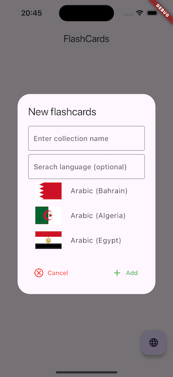

# Flashcards

Language leraning app

## Current state of project
First page You see after launch app. Click on word icon to add new collection.

Enter collection name, select language (optional) and press "Add" to save new collection.

Home page with some collections.
Tap on card to see words in collection.

Swipe left or right for remove collection.

Press + icon to add new word to collection.

Enter oryginal and translated word, then press "Add" to add new word to current collection.

All words in Your collection

You can easily edit words by pressing pen icon, if You made mistake.  
